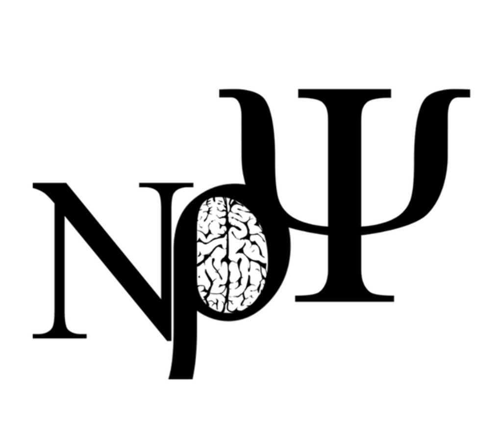

---
title: nu rho psi leadership
layout: template
filename: nrp_leadership.md
--- 

<!DOCTYPE html>
<html lang="en">

<head>
    <meta charset="UTF-8">
    <meta name="viewport" content="width=device-width, initial-scale=1.0">
    <title>Hook</title>
    <link rel="stylesheet" href="https://cdn.jsdelivr.net/npm/shorthandcss@1.1.1/dist/shorthand.min.css" />
    <link rel="stylesheet" href="https://fonts.googleapis.com/css?family=Muli:200,300,400,500,600,700,800,900&display=swap" />
    <link rel="stylesheet" type="text/css"
        href="https://cdnjs.cloudflare.com/ajax/libs/slick-carousel/1.9.0/slick.min.css" />
    <link rel="stylesheet" type="text/css" href="//cdn.jsdelivr.net/npm/slick-carousel@1.8.1/slick/slick-theme.css" />
</head>

<body class="bg-black muli">
    <nav class="w-100pc flex flex-column md-flex-row md-px-10 py-5 bg-black">
        

            
            <a data-toggle="toggle-nav" data-target="#nav-items" href="#"
                class="flex items-center ml-auto md-hidden indigo-lighter opacity-50 hover-opacity-100 ease-300 p-1 m-3">
                <i data-feather="menu"></i>
            </a>
        

        

            <a href="#home" class="fs-s1 mx-3 py-3 indigo no-underline hover-underline">Home</a>
            <a href="#features" class="fs-s1 mx-3 py-3 indigo no-underline hover-underline">Features</a>
            <a href="#leadership_introduction" class="fs-s1 mx-3 py-3 indigo no-underline hover-underline">Leadership</a>
            <a href="#blog" class="fs-s1 mx-3 py-3 indigo no-underline hover-underline">Blog</a>
            <a href="#subscribe" class="button bg-white black fw-600 no-underline mx-5">subscribe</a>
        

    </nav>

    <!-- introduction -->
    <section id="fifi_introduction" class="p-10 md-p-l5">
        

            

                

                    
                    <h4 class="white fw-600 fs-m3 mb-5">Fifi Pan</h4>
                    
 <a href="https://wanqingpan.github.io/" >Fifi</a> is a sophomore studying Neuroscience with a minor in Disruptive Innovation at the University of Southern California. She aspires to generate value by renovating the pipeline from neuroscience research to groundbreaking technological innovations accessible to everyone, any place, any time. During her gap year, she worked within venture capital at MiraclePlus (former Y-Combinator China), an ESG SaaS startup, and an AR ADHD Prevention startup. On-campus, Fifi is a lead researcher in MacLean Lab for mathematical modeling of myeloid-derived suppressor cells in tumor microenvironment and a bioinformatics researcher in Bonaguidi Lab in examining neural stem cell and neural circuit plasticity. Fifi is co-president of the National Neuroscience Honors Society’s USC Chapter, a Speech Coach at TEDxUSC, and a member of Chinese Students and Scholars Association’s Career Development Department.

</section>
    <!-- subscribe -->
    <a id="subscribe">
    <section class="p-10 md-p-l5">
        

            

                <h2 class="white fs-m4 fw-800">Join Email List</h2>
                
Keep up with Nu Rho Psi for special lecture series and exclusive events.

            

            

                

                    <input type="text"
                        class="input-lg flex-grow-1 bw-0 fw-200 bg-indigo-lightest-10 white ph-indigo-lightest focus-white opacity-80 fs-s3 py-5 br-r-0"
                        placeholder="Email Address">
                    <button class="button-lg bg-indigo indigo-lightest fw-300 fs-s3 br-l-0">Join Email List</button>
                

            

        

    </a>

    </section>

    <!-- footer -->
    <footer class="p-5 md-p-l5 bg-indigo-lightest-10">
        

            

                
                

                    
Diversity, Equity and Inclusivity: Nu Rho Psi endorses and supports the policies of the Faculty for Undergraduate Neuroscience and the Society for Neuroscience.

                

            

            

                

                    <input type="text"
                        class="input flex-grow-1 bw-0 fw-200 bg-indigo-lightest-10 white ph-indigo-lightest focus-white opacity-80 fs-s3 py-5 br-r-0"
                        placeholder="Email Address">
                    <button class="button bg-indigo indigo-lightest fw-300 fs-s3 br-l-0">Start</button>
                

                

                    <a href="#" class="relative p-5 bg-indigo br-round white hover-scale-up-1 ease-400"><i
                            data-feather="twitter" class="absolute-center h-4"></i></a>
                    <a href="#" class="relative p-5 bg-indigo br-round white hover-scale-up-1 ease-400"><i
                            data-feather="facebook" class="absolute-center h-4"></i></a>
                    <a href="#" class="relative p-5 bg-indigo br-round white hover-scale-up-1 ease-400"><i
                            data-feather="instagram" class="absolute-center h-4"></i></a>
                

            

        

    </footer>
    
    
    
    
    
</body>

</html>
